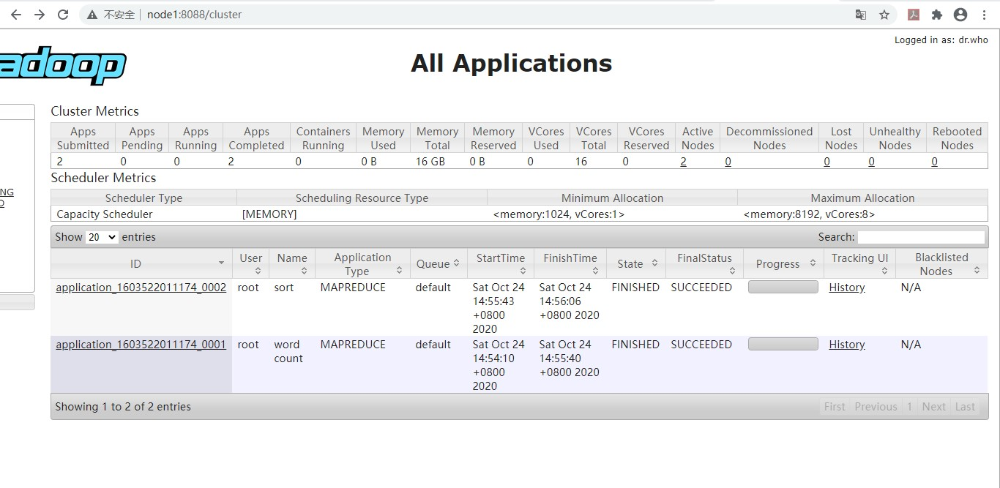
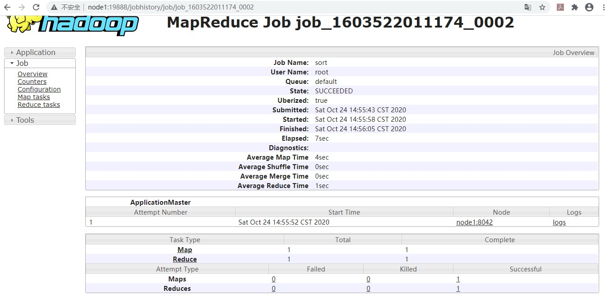
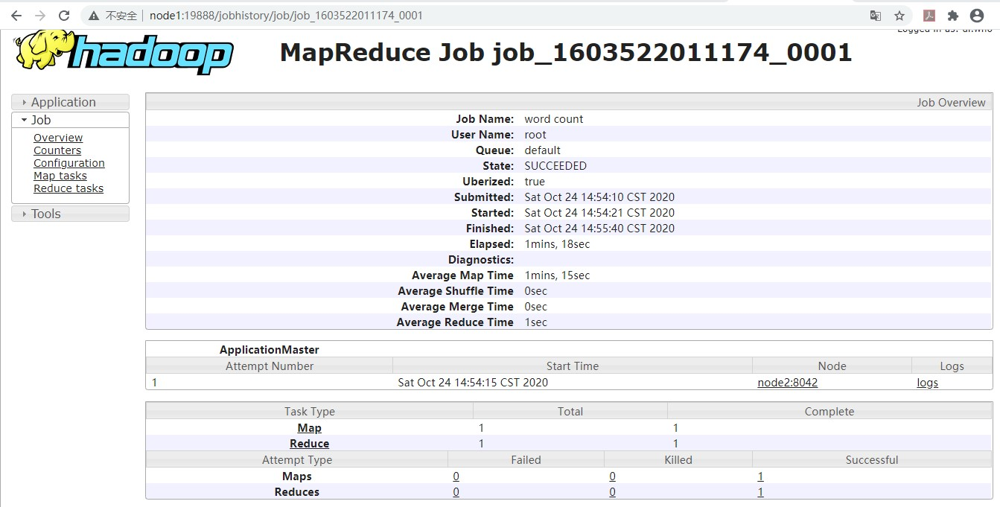
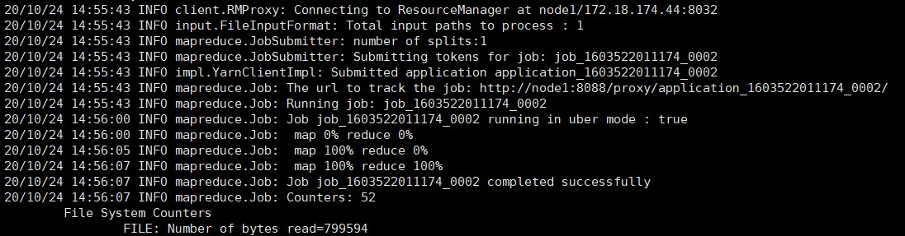
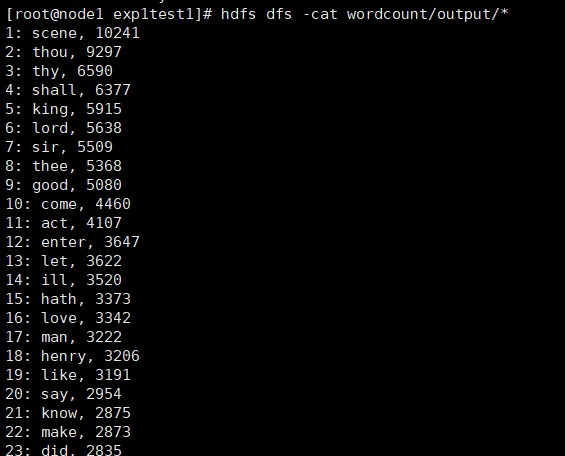
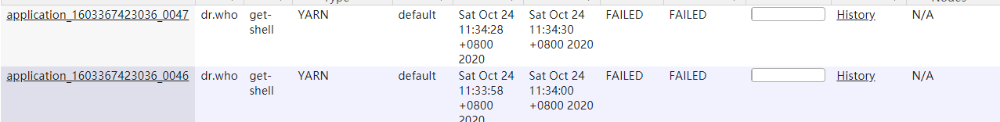

# 作业5  

## 设计思路  

为了实现作业5的需求，WordCount3由Hadoop官网给出的WordCount2.0版本修改而来。WordCount2.0已经实现了忽略大小写和忽略标点符号的需求。下面针对新增的需求给出实现方案。  

### (1) 忽略停词  
这个可以仿照WordCount2中忽略大小写的策略来设计。主要的难点是将停词表文件读入到缓存中。  
先来看一下WordCount2如何将忽略标点符号的文件读入系统。  
```java  
for (int i=0; i < remainingArgs.length; ++i) {
    if ("-skip".equals(remainingArgs[i])) {
    job.addCacheFile(new Path(remainingArgs[++i]).toUri());
    job.getConfiguration().setBoolean("wordcount.skip.patterns", true);
    }  
```  
这里遍历输入的参数，如果读到了“-skip”参数，就获取紧跟着它的文件路径，将目标文件（标点符号列表punctuation.txt）加入到CacheFile中，并将wordcount.skip.patterns变量设为true。而在setup方法中，将会从CacheFile中读取已经存好的标点符号文件，将标点符号存在HashSet中。  
```java  
if (conf.getBoolean("wordcount.skip.patterns", true)) {
    URI[] patternsURIs = Job.getInstance(conf).getCacheFiles();
    for (URI patternsURI : patternsURIs) {
        Path patternsPath = new Path(patternsURI.getPath());
        String patternsFileName = patternsPath.getName().toString();
        parseSkipFile(patternsFileName);
    }
```  
那我也仿照这个方法，如果出现了'-stop'参数之后，就将紧跟着的文件路径加入到CacheFile中，在setup里载入第2个CacheFile时，将所有停词存入到一个HashSet中。在map方法里，每次处理一个单词word时，都判断word是否在停词表里，若不存在，才将当前的key-value对写入到map方法的输出。  
首先是从参数中获得文件路径并写入CacheFile  
```java  
else if ("-stop".equals(remainingArgs[i])) {     //添加参数获得停词文件
    job.addCacheFile(new Path(remainingArgs[++i]).toUri());     //将停词文件加入cachefile
    job.getConfiguration().setBoolean("wordcount.stop.words", true);
    } 
```  
然后在setup方法中对第二个CacheFile进行处理。  
```java  
Path patternsPath = new Path(patternsURI.getPath());
String patternsFileName = patternsPath.getName().toString();
StopwordsFile(patternsFileName);
```  
StopwrodsFile()方法：
```java  
//将停词文件的单词写入停词表
private void StopwordsFile(String fileName) {
    try {
    fis = new BufferedReader(new FileReader(fileName));
    String pattern = null;
    while ((pattern = fis.readLine()) != null) {
        StopWords.add(pattern);
    }
    } catch (IOException ioe) {
    System.err.println("Caught exception while parsing the cached file '"
        + StringUtils.stringifyException(ioe));
    }
}
```  
在map方法中增加判断条件，新单词new_word不能在停词表中。  
```java  
String new_word=itr.nextToken();
if (!StopWords.contains(new_word) && new_word.length()>=3) {      //检查单词不能在停词表中，且长度大于等于3
    word.set(new_word);
    context.write(word, one);
    Counter counter = context.getCounter(CountersEnum.class.getName(),
    CountersEnum.INPUT_WORDS.toString());
    counter.increment(1);
}
```  
  
### (2) 单词长度大于等于3  
在map方法写入key-value对时添加一个判断条件即可，上面也有提到  
```java  
if (!StopWords.contains(new_word) && new_word.length()>=3)
```  

### (3) 忽略数字  
其实实现了单词长度大于等于3的需求之后这个就不用考虑了，设置了长度限制之后单词里面几乎就没有数字了。如果还是不放心的话直接在忽略标点符号的文件punctuation.txt里面加上0-9，将所有数字自动替换成空字符即可。  

### (4) 按出现次数降序排序  
这里的策略是在原有的mapreduce的基础上对输出做第二次mapreduce。第一次输出的是key-value对是<单词>-<频数>，第二次mapreduce的key-value对将上一次的输出结果对调，即<频数>-<单词>。设置reducer的数量为1，利用从mapper到reducer中间的shuffle对key-value对按照key值自动排序。那么最后进入reducer的key-value对都是按照key值已经排好序的，reducer不需要做任何事情，最终输出就能得到排好序的结果。  
这里需要注意的一点是，shuffle中默认是按照升序排序的，而需求是按照降序排序，所以需要自己定义Comparator，只需要继承原有的Comparator，对比较方法返回的值加上一个负号即可。  
下面是实现细节：  
main方法中，执行完第一个job之后执行第二个job，实现排序  
```java  
if (job.waitForCompletion(true)){
    conf.set("mapreduce.output.textoutputformat.separator", ": ");
    Job sortJob = Job.getInstance(conf,"sort");

    sortJob.setJarByClass(WordCount3.class);
    //上一个job的结果输出到了临时文件夹中，这次从临时文件夹中读入。
    FileInputFormat.addInputPath(sortJob, tempDir);
    sortJob.setInputFormatClass(SequenceFileInputFormat.class);

    //使用mapreduce中内置的InverseMapper，将key-value对调
    sortJob.setMapperClass(InverseMapper.class);
    sortJob.setReducerClass(SortReducer.class);
    //设置reduce个数为1，保证reducer中是所有排好序的key-value对
    sortJob.setNumReduceTasks(1);
    FileOutputFormat.setOutputPath(sortJob,new Path(otherArgs.get(1)));

    sortJob.setOutputKeyClass(IntWritable.class);
    sortJob.setOutputValueClass(Text.class);

    //设置comparator，将升序变为降序
    sortJob.setSortComparatorClass(IntWritableDecreasingComparator.class);

    System.exit(sortJob.waitForCompletion(true) ? 0 : 1);
}
```  
定义新的comparator
```java  
private static class IntWritableDecreasingComparator extends IntWritable.Comparator {
    public int compare(WritableComparable a, WritableComparable b) {
        return -super.compare(a, b);
    }
    public int compare(byte[] b1, int s1, int l1, byte[] b2, int s2, int l2) {
        return -super.compare(b1, s1, l1, b2, s2, l2);
    }
}
```  

### (5) 输出前100个高频单词  
这个需求的实现方法可以有很多，可以设计reducer也可以设计FileOutputFormat。我的方案是设计第二个job的reducer。由于之前已经将reducer的数量设为了1个，所以最终从reducer输出的前100个key-value对一定是所有key-value对中的前100个。设计reducer的时候只需要考虑控制conext.write()的调用次数即可。  
作业中要求输出有一定的格式：<排名>：<单词>，<次数>。因此还需要修改reducer的输出格式，将key设置为count，而频数和单词重新组合成为一个Text作为value输出。由于key和value的分隔符为':'，因此还需要手动设置分隔符: conf.set("mapreduce.output.textoutputformat.separator", ": ");  
下面是排序job的reducer代码：  
```java  
public static class SortReducer
       extends Reducer<IntWritable,Text,IntWritable,Text> {
    private int count=1;  //记住输出的次数

    public void reduce(IntWritable key, Iterable<Text> values,
                       Context context
                       ) throws IOException, InterruptedException {
      for (Text val : values) {
        if (count<=100) {   //reducer输出100次，即为前100的高频单词
            context.write(new IntWritable(count),new Text(val.toString()+", "+key.toString()));
            count++;
        }
      }
    }
  }
```  

## 运行  
使用maven打包对项目打包，可执行的jar包为 WordCount3-1.0-SNAPSHOT.jar，模块为com.hw5.WordCount3，加上参数-Dwordcount.case.sensitive=false表示忽略大小写，-skip wordcount/punctuation.txt表示忽略标点，-stop wordcount/stop-word-list.txt忽略停词。完整运行命令如下：  
hadoop jar WordCount3-1.0-SNAPSHOT.jar com.hw5.WordCount3 -Dwordcount.case.sensitive=false wordcount/input/Shakespeare.txt wordcount/output -skip wordcount/punctuation.txt -stop wordcount/stop-word-list.txt  

## 运行结果  
运行输出的文件放在了output/result中。下面是截图：  
  
  
  
  
  

## 不足和可改进之处  

### (1) 没有考虑忽略参数的情况
由于标点符号文件和停词列表文件都是从CacheFile顺序读入的，默认情况下都认为会从命令行参数传入两个文件的路径，然后顺序写入CacheFile，后面HashSet的建立也是从CacheFile顺序读入文件。如果没有输入忽略标点符号参数或者忽略停词参数，程序就不能正常运行。应该设计不同的参数输入模式。对于存入CacheFile的路径，不管是否有都进行写入，如果给出了路径的话就写入路径，没有的话写入一个默认值。setup方法中根据路径的值判断是否建立标点符号表或停词表。  

### (2) 可以从OutputFormat上设计输出格式  
对于作业中输出格式的要求，我是在reducer中进行调整的。但是这有很多的局限性，如果输出格式要求不止两列而是多列，或者是按不同格式输出到多个文件中，那么仅仅设计reducer是不能实现需求的。因此自定义输出格式，设计OutputFormat和RecordWriter。由于对这一部分了解还不是很深，需要继续研读源码，完成一些模仿，才能实现自定义输出格式。  

## 后记  
前一天在我的阿里云集群上跑完之后忘记关掉Hadoop了，第二天起来看到了两个不寻常的job，都不是我自己提交的。  
  
看到了名为get-shell的job名称，我感觉到了一丝不祥，集群可能遭到攻击了。攻击貌似失败了，所以也没管。但是下午阿里云报警，上控制台一看傻眼了。  
  
随后node2怎么登也登陆不上，应该是被提取shell权限，里面原来的ssh文件都被删了，CPU负载这么高可能是挖矿病毒。唉，倒霉啊！无奈重置实例，环境又要重新配了。尚未查明原因，网上有的说是从Hadoop的漏洞渗透的，还有可能是我开放了所有端口，总之在云上操作还是很有风险的。  